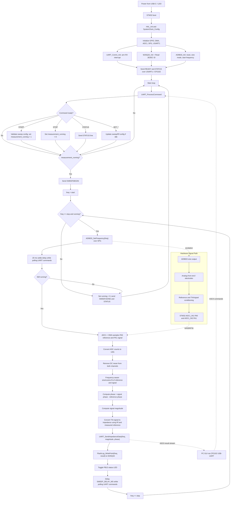

# Software Data Flow

This note correlates the current schematic with the firmware in this project.

## Schematic To Firmware Correlation

| Schematic block | Firmware evidence | Current role |
| --- | --- | --- |
| STM32F303CCT6 MCU | CubeMX target `STM32F303CCTx` in `Impedance-measurement-git.ioc`, firmware in `Core/Src/main.c` | Main controller for sweep orchestration, ADC sampling, SPI, UART, and status LED. |
| CP2102 USB-UART bridge | USART1 on PA9/PA10 at 115200 baud | PC/GUI command input and measurement result output. |
| AD9833 signal generator | SPI1 PA5/PA6/PA7 plus `AD9833_FSYNC` on PA4 | Firmware programs sine-wave excitation frequency during the sweep. |
| XTAL-25MHz1 / ASE-25.000MHZ-LC-T 25 MHz oscillator | XTAL-25MHz schematic block feeding the AD9833 clock input | Firmware assumes this clock as `AD9833_MCLK = 25000000UL` for frequency tuning-word calculation. |
| 8MHz-crystal1 / ABM3B-8.000MHZ-B2-T crystal | STM32 HSE crystal on PF0/OSC_IN and PF1/OSC_OUT | MCU clock source used by `SystemClock_Config()` to derive the firmware system/peripheral clocks. |
| Analog front end with OPA2140AID precision op-amp stages | ADC1_IN1 on PA0, ADC1_IN2 on PA1 | Firmware samples reference and signal channels through ADC1 + DMA. |
| Electrode connector | External electrode interface routed into the analog front end | Physical connection to the measured impedance/load. |
| SPI-Flash1 / W25Q32JVSSIQ SPI flash | SPI1 plus `W25Q32_CS` on PB12 | Firmware initializes flash, reads JEDEC ID at boot, and stores sweep measurement records. |
| Status LED | PB13 | Toggled once per measured frequency point. |
| ADR4533BRZ voltage reference | Lower-right schematic reference block feeding the analog measurement path | Precision hardware reference source for the analog front end/ADC path; no direct software control. |
| SWD connector | PA13/PA14 plus reset, VDD, GND, key, and detect pins | Debug/programming connector only; SWDIO maps to PA13 and SWDCLK maps to PA14 in the firmware/CubeMX pinout. |
| USB-C power and MCP1700 LDO regulation | Board-level power path generating the regulated supply rail | No direct software interaction. |

## AD9833 Signal Generator Mapping

| AD9833 schematic pin/signal | Firmware/CubeMX mapping | Data-flow meaning |
| --- | --- | --- |
| `SDATA` | SPI1 MOSI on PA7 | Serial tuning/control data from STM32 to AD9833. |
| `SCLK` | SPI1 SCK on PA5 | Serial clock for AD9833 register writes. |
| `FSYNC` | GPIO output `AD9833_FSYNC` on PA4 | AD9833 chip-select/frame-sync controlled around each SPI register write. |
| `MCLK` | `XTAL-25MHz1` / 25 MHz `ASE-25.000MHZ-LC-T` oscillator | Master clock used by AD9833 DDS; firmware constant is `AD9833_MCLK = 25000000UL`. |
| `VOUT` | Analog output into the measurement front end/electrodes | Excitation waveform generated during the frequency sweep. |
| `VDD`, `AGND`, `DGND`, `CAP/2.5V`, `COMP` | Board-level power, grounding, and decoupling/compensation | Required for AD9833 operation; no direct firmware control. |

## MCU Clock Mapping

| Schematic block | Firmware/CubeMX mapping | Data-flow meaning |
| --- | --- | --- |
| `8MHz-crystal1` / `ABM3B-8.000MHZ-B2-T` | PF0/OSC_IN and PF1/OSC_OUT | External HSE source for the STM32 clock tree. |
| Load capacitors, 22 pF each | Board-level crystal network | Required for oscillator operation; no direct firmware control. |
| `SystemClock_Config()` | HSE + PLL configuration in `Core/Src/main.c` | Derives the MCU system clock and peripheral clocks used by ADC, SPI, and USART. |

## CP2102 USB-UART Mapping

| CP2102 schematic pin/signal | Firmware/CubeMX mapping | Data-flow meaning |
| --- | --- | --- |
| `TXD` | STM32 USART1 RX on PA10 | Command data from PC/USB bridge into STM32. |
| `RXD` | STM32 USART1 TX on PA9 | Status and impedance result data from STM32 to PC/USB bridge. |
| `D+`, `D-`, `VBUS`, `REGIN`, `VDD`, `GND` | USB and CP2102 board-level power/USB wiring | USB transport and power/reference wiring for the bridge; no STM32 firmware control. |
| `RST`, `SUSPEND`, `SUSPEND`, `CTS`, `RTS`, `DSR`, `DTR`, `DCD`, `RI` | Present on schematic symbol | Not used by the current firmware command protocol; USART1 is configured without hardware flow control. |

## SPI Flash Mapping

| W25Q32JVSSIQ schematic pin/signal | Firmware/CubeMX mapping | Data-flow meaning |
| --- | --- | --- |
| `/CS` | GPIO output `W25Q32_CS` on PB12 | Flash chip-select controlled by the `w25q32.c` driver. |
| `CLK` | SPI1 SCK on PA5 | Shared SPI clock. |
| `DI(IO0)` | SPI1 MOSI on PA7 | Data/commands from STM32 to flash. |
| `DO(IO1)` | SPI1 MISO on PA6 | Data from flash to STM32. |
| `/WP(IO2)`, `/HOLD_OR_/RESET(IO3)` | Board-level flash pins | Not actively controlled by current firmware. |
| `VCC`, `GND` | Board-level power/ground | Required for flash operation; no direct firmware data role. |

## USB-C Power Input Mapping

| USB-C schematic pin/signal | Firmware/CubeMX mapping | Data-flow meaning |
| --- | --- | --- |
| `VBUS` | Board-level 5 V input rail | Feeds the power tree before regulation; no direct firmware control. |
| `CC1`, `CC2` with 5.1 kOhm resistors | USB-C sink configuration hardware | Advertises the board as a USB-C power sink. |
| `DP1`, `DN1`, `DP2`, `DN2` | Routed USB data pair wiring toward the USB-UART path | Physical USB data lines for the CP2102 bridge, not native STM32 USB firmware. |
| `SBU1`, `SBU2` | Present on connector | Not used by the current firmware data path. |
| `SHIELD`, `GND` | Chassis/ground wiring | Board-level grounding only. |

## Analog Front End Mapping

| Schematic block | Firmware/CubeMX mapping | Data-flow meaning |
| --- | --- | --- |
| Electrode connector | Board-level connector carrying `Electrode1` and `Electrode2` signals | External measurement interface where the unknown impedance/electrodes connect. |
| OPA2140AID precision op-amp stage 1 | Feeds one of the STM32 ADC measurement inputs | Conditions the AD9833 excitation/reference or measurement signal before ADC sampling. |
| OPA2140AID precision op-amp stage 2 | Feeds one of the STM32 ADC measurement inputs | Conditions the second analog channel before ADC sampling. |
| ADC reference channel | ADC1_IN1 on PA0 | Sampled as the reference waveform in `adc_buffer[2 * i]`. |
| ADC signal channel | ADC1_IN2 on PA1 | Sampled as the measured signal waveform in `adc_buffer[2 * i + 1]`. |

## Active Runtime Behavior

At boot, `main()` initializes HAL, system clocks, GPIO, DMA, ADC1, SPI1, USART1, the UART command layer, SPI flash, and the AD9833. It then sends `READY` and a `STATUS,...` line over UART.

## Complete PCB-Level Understanding

At the full-system level, the PCB is an STM32-controlled impedance measurement board. USB-C provides the external connection and board power. The MCP1700 generates the regulated supply rail, while the ADR4533BRZ provides the precision analog reference/biasing support for the measurement front end.

The STM32F303CCT6 is the control and computation core. Its 8 MHz crystal feeds the MCU clock tree through `SystemClock_Config()`. The MCU uses SPI1 for two devices on a shared bus: the AD9833 signal generator and the W25Q32JVSSIQ SPI flash. The AD9833 has its own 25 MHz oscillator and produces the analog excitation waveform at `VOUT`; the firmware changes this excitation frequency during a sweep. The flash is initialized and identified at boot, then a reserved log region is erased at sweep start and filled with one stored measurement record per frequency point.

The analog measurement path starts at the electrode connector. The AD9833 excitation and electrode response pass through the OPA2140AID precision op-amp stages and surrounding passive network. The conditioned reference and signal channels enter the STM32 on ADC1_IN1/PA0 and ADC1_IN2/PA1. Firmware captures these two interleaved ADC channels using DMA, removes DC offset, estimates magnitude and phase, then converts the measured signal into impedance using the configured feedback resistor.

The CP2102 is the communication bridge to the PC. USB data terminates at the CP2102, not at native STM32 USB firmware. The firmware talks to the PC through USART1: CP2102 TXD feeds STM32 PA10/RX, and STM32 PA9/TX feeds CP2102 RXD. ASCII commands configure/start/stop sweeps, and ASCII result lines carry frequency, magnitude, and phase back to the PC.

SWD is only for programming/debugging. It does not participate in the measurement data path.

The PC sends newline-terminated ASCII commands over the CP2102/USART1 path. `uart_comm.c` receives bytes using UART interrupt mode, buffers a command line, then `UART_ProcessCommand()` dispatches commands:

- `START`
- `STOP`
- `STATUS`
- `SET_START_FREQ,<Hz>`
- `SET_STOP_FREQ,<Hz>`
- `SET_STEP_FREQ,<Hz>`
- `SET_RF,<ohms>`

When `measurement_running` is set by `START`, the main loop performs a frequency sweep from `SWEEP_START_FREQUENCY` to `SWEEP_STOP_FREQUENCY` using `SWEEP_STEP_FREQUENCY`. Defaults are 1000 Hz to 100000 Hz in 1000 Hz steps, with 100 ms between points.

At each frequency point, the firmware:

1. Programs the AD9833 frequency over SPI1.
2. Waits briefly for the analog path to settle while still processing UART commands.
3. Starts ADC1 DMA for `2 * SAMPLE_COUNT` half-word samples.
4. Converts interleaved ADC data into reference and signal voltage arrays.
5. Removes DC offset from each channel.
6. Computes a frequency-aware sine/cosine fit for reference and signal using the requested excitation frequency and the ADC sample-rate estimate.
7. Derives signal magnitude and phase relative to the reference.
8. Converts signal voltage to impedance using the configured feedback resistor and measured reference amplitude: `current_peak = measured_signal / Rf`, then `Z = measured_reference / current_peak`.
9. Sends the result over UART and toggles the status LED.

## Flowchart

## Current Notes Versus Schematic

- SPI flash logging stores the latest sweep in a reserved flash region. The UART commands `FLASH_STATUS`, `ERASE_FLASH`, and `DUMP_FLASH` provide status, manual erase, and readback.
- `Process_Impedance(float frequency)` now uses the actual excitation frequency for its sine/cosine fit. The sample-rate estimate is derived from the current CubeMX ADC configuration: 72 MHz ADC clock, 61.5 sample cycles, 12.5 conversion cycles, and two scanned ADC channels.
